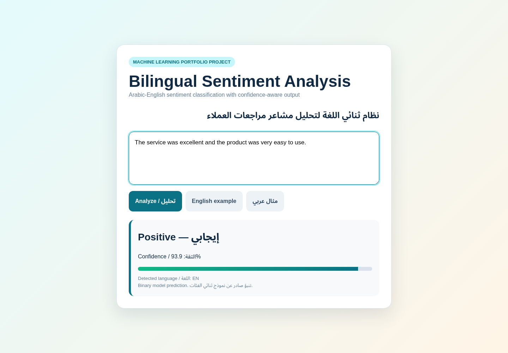
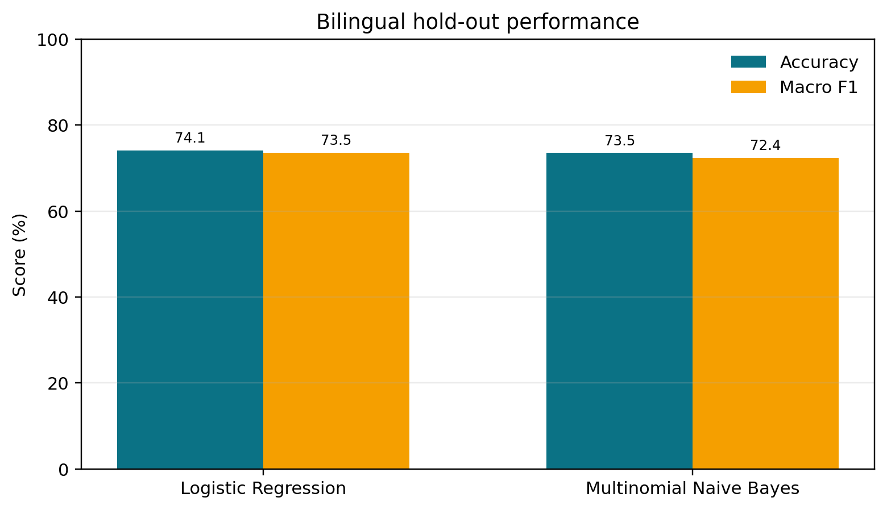
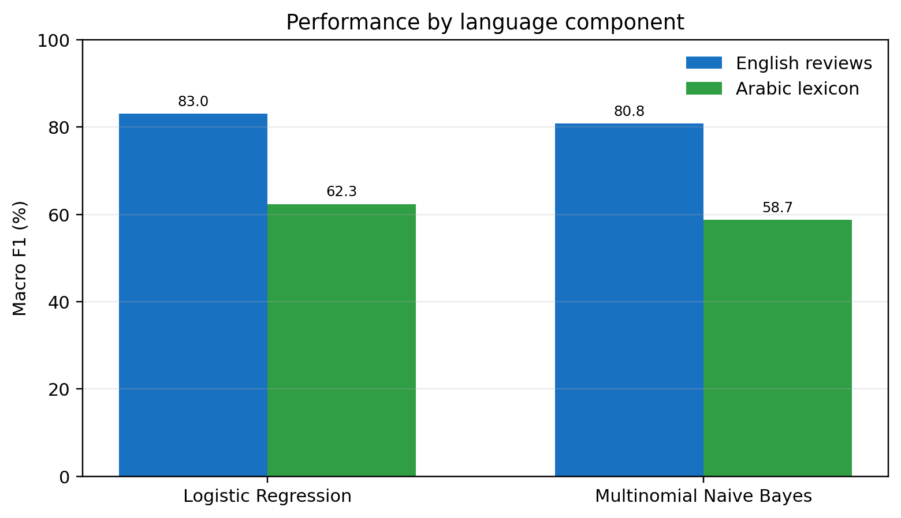
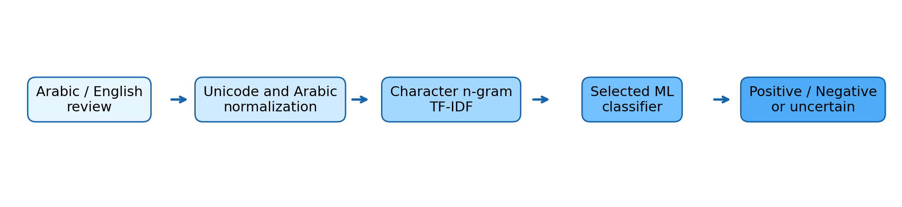

# Bilingual Arabic-English Sentiment Analysis

A reproducible machine-learning project for classifying **Arabic and English sentiment** with a shared character-level TF-IDF pipeline. The system compares two classical ML models, evaluates them with cross-validation and a held-out test set, saves the best model, and exposes predictions through both a CLI and a lightweight local web interface.

> **Portfolio note:** This project was completed as a three-person academic team project by Mohammad Rouhi Khattab, Salam Al-Buhaisi, and Mohammad Abu Khammash. The repository contains the complete delivered implementation, evaluation artifacts, paper, and presentation.

## Demo



The interface accepts Arabic or English text and returns a bilingual sentiment label with confidence. If the model confidence is below the configured threshold, the result is reported as **Neutral / uncertain**. This is an abstention mechanism, not a separately trained third class.

## Highlights

- Arabic-English text normalization and language detection.
- Character n-gram TF-IDF features (`3–5` characters) that work across both scripts.
- Model comparison between **Logistic Regression** and **Multinomial Naive Bayes**.
- Stratified `80/20` hold-out evaluation and **5-fold cross-validation**.
- Reproducible data-preparation and training scripts with random seed `42`.
- Saved production-style inference pipeline with `joblib`.
- Bilingual CLI and dependency-light local web UI.
- Automated smoke tests and GitHub Actions CI.
- Research paper, presentation, metrics, predictions, and evaluation figures included.

## Results

The processed dataset contains **6,262 records**: `2,979` English review sentences and `3,283` Arabic lexicon entries.

| Metric | Logistic Regression | Multinomial NB |
| --- | ---: | ---: |
| Hold-out accuracy | **74.06%** | 73.50% |
| Hold-out macro F1 | **73.53%** | 72.40% |
| 5-fold CV macro F1 | **73.38%** | 72.22% |

The selected Logistic Regression model achieved:

- **83.05% English accuracy** on held-out customer-review sentences.
- **65.91% Arabic accuracy** on held-out translated sentiment terms.





## System Architecture



```text
Arabic / English text
        ↓
Unicode + Arabic normalization
        ↓
Character n-gram TF-IDF
        ↓
Logistic Regression
        ↓
Positive / Negative / Uncertain output
```

## Tech Stack

- **Python 3.12+**
- **scikit-learn**
- **pandas**
- **NumPy**
- **matplotlib**
- **joblib**
- Python standard-library HTTP server for the local demo

## Project Structure

```text
.
├── app.py                     # CLI + shared inference function
├── web_app.py                 # Local bilingual web interface
├── src/
│   ├── prepare_data.py        # Reproducible dataset construction
│   ├── text_utils.py          # Normalization + language detection
│   └── train.py               # Training, evaluation, charts, persistence
├── tests/
│   └── test_smoke.py          # Text and end-to-end model smoke tests
├── data/
│   ├── raw/                   # Source datasets / lexicon
│   └── processed/             # Prepared bilingual dataset
├── models/                    # Saved selected model + metadata
├── results/                   # Metrics, predictions, evaluation figures
├── docs/                      # Report and demo/discussion guide
└── paper/                     # Research paper and presentation
```

## Quick Start

### 1. Clone and enter the project

```bash
git clone https://github.com/m7mdkh2003/bilingual-arabic-english-sentiment-analysis.git
cd bilingual-arabic-english-sentiment-analysis
```

### 2. Create a virtual environment

**Windows**

```powershell
python -m venv .venv
.venv\Scripts\activate
```

**macOS / Linux**

```bash
python3 -m venv .venv
source .venv/bin/activate
```

### 3. Install dependencies

```bash
python -m pip install --upgrade pip
python -m pip install -r requirements.txt
```

### 4. Run the web demo

A trained model is already included, so you can start the app directly:

```bash
python web_app.py
```

Open `http://127.0.0.1:8000`.

## CLI Usage

```bash
python app.py --text "This product is excellent and easy to use."
python app.py --text "الخدمة سيئة وبطيئة جداً"
python app.py --text "منتج ممتاز" --json
```

Example JSON output:

```json
{
  "detected_language": "ar",
  "label": "positive",
  "label_en": "Positive",
  "label_ar": "إيجابي",
  "confidence": 0.91
}
```

## Rebuild the Dataset and Model

The repository includes the raw data required to reproduce the delivered experiment.

```bash
python -m src.prepare_data
python -m src.train
```

Training regenerates:

- `models/best_model.joblib`
- `models/metadata.json`
- `results/metrics.json`
- `results/test_predictions.csv`
- evaluation charts in `results/`

## Tests

Run the local test suite:

```bash
python -m unittest discover -s tests -v
```

The CI workflow in `.github/workflows/tests.yml` runs the same tests automatically on pushes and pull requests.

## Data Sources

### English component

The English component uses the **UCI Sentiment Labelled Sentences** dataset, with review sentences from Amazon, IMDb, and Yelp. The project uses approximately 3,000 labelled English sentences.

- UCI dataset DOI: `10.24432/C57604`
- License: CC BY 4.0
- Full attribution and source details: [`DATA_SOURCES.md`](DATA_SOURCES.md)

### Arabic component

The Arabic component uses non-zero Arabic entries from the translated **AFINN-165** sentiment lexicon distributed by `multilang-sentiment` under the MIT license.

See [`DATA_SOURCES.md`](DATA_SOURCES.md) for the source and ethical-use notes.

## Important Limitations

This project deliberately reports its limitations rather than presenting the Arabic evaluation as equivalent to full Arabic review classification:

1. **English evaluation** uses held-out natural customer-review sentences.
2. **Arabic evaluation** uses held-out translated sentiment terms and short phrases from AFINN, not a large natural Arabic review corpus.
3. **Neutral / uncertain** is produced when prediction confidence is below `0.60`; it is not a third class learned during training.
4. The next research step should evaluate and fine-tune on a manually annotated Arabic review corpus, ideally including Palestinian Arabic and other dialects.

Because of these constraints, this repository is best interpreted as a **reproducible bilingual ML prototype and research project**, not a production-grade Arabic sentiment service.

## Research Artifacts

- [`paper/ICRE_2026_Final_Bilingual_Sentiment_Paper.pdf`](paper/ICRE_2026_Final_Bilingual_Sentiment_Paper.pdf)
- `paper/ICRE_2026_Final_Bilingual_Sentiment_Paper.docx`
- `paper/ICRE_2026_Bilingual_Sentiment_Presentation_AR_EN.pptx`
- [`docs/PROJECT_REPORT_BILINGUAL.md`](docs/PROJECT_REPORT_BILINGUAL.md)
- [`docs/DEMO_AND_DISCUSSION_GUIDE.md`](docs/DEMO_AND_DISCUSSION_GUIDE.md)

## Arabic Summary / ملخص عربي

المشروع يقدّم نموذجاً عملياً لتحليل المشاعر في النصوص العربية والإنجليزية باستخدام **TF-IDF على مستوى الأحرف** ونموذج **Logistic Regression**. يمكن تشغيله من سطر الأوامر أو من واجهة ويب محلية، كما يحتوي على خطوات قابلة لإعادة الإنتاج لتجهيز البيانات والتدريب والتقييم.

التقييم الإنجليزي يعتمد على جمل مراجعات حقيقية، بينما الجزء العربي يعتمد على معجم AFINN مترجم؛ لذلك لا يتم تقديم دقة العربية على أنها تقييم كامل على مراجعات عربية طبيعية. نتيجة **محايد / غير مؤكّد** تعني انخفاض ثقة النموذج وليست فئة ثالثة مدرّبة.
